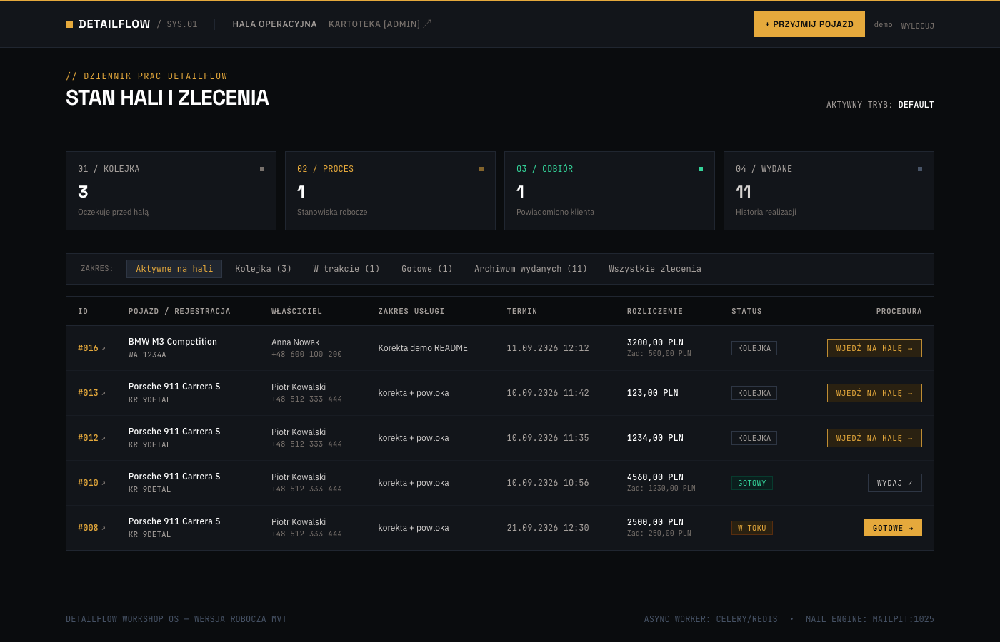
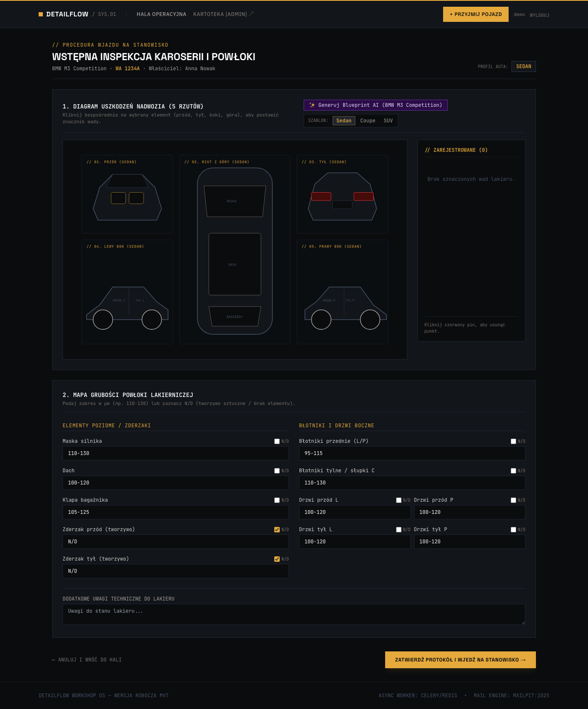
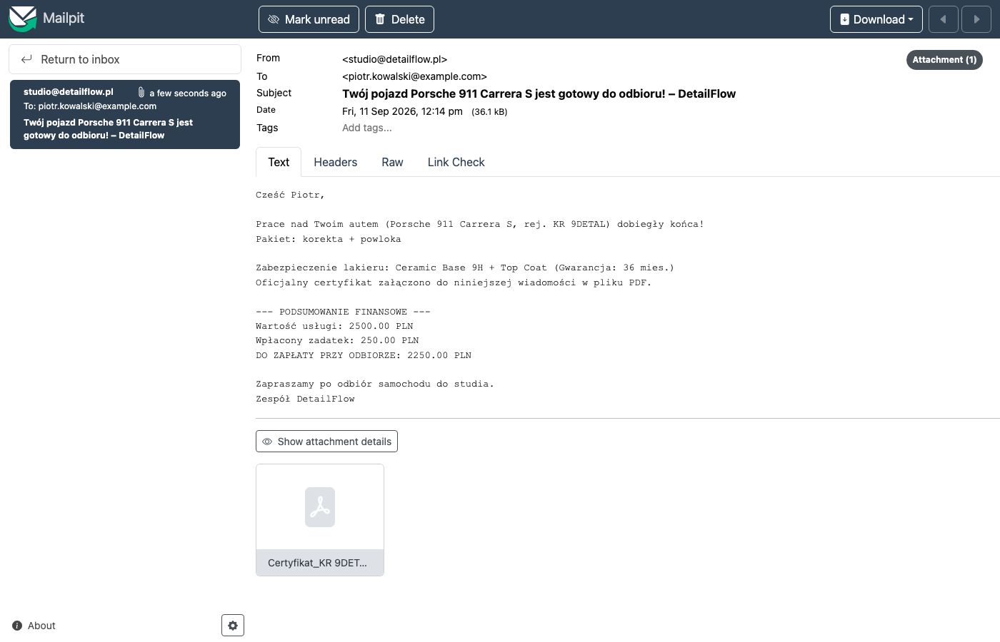

# DetailFlow

**System operacyjny studia autodetailingu** — projekt praktyk studenckich / portfolio backend.

Django **MVT** + PostgreSQL + Redis/Celery + Tailwind (CDN). Aplikacja prowadzi pojazd od przyjęcia, przez wjazd na halę i rozliczenie materiałów, aż do wydania klientowi z powiadomieniem e-mail i opcjonalnym certyfikatem PDF powłoki ceramicznej.

> **MVP / wersja robocza** — środowisko deweloperskie pod Dockerem. Nie jest to gotowy produkt produkcyjny (brak gunicorn/nginx, pełnych ról, płatności online).

---

## Problem → rozwiązanie

| W realnym studiu | W DetailFlow |
|------------------|--------------|
| Status auta w głowie / na kartce | Tablica hali ze statusami |
| Protokół lakieru na papierze | Check-in + pomiary µm w systemie |
| Zdjęcia uszkodzeń w galerii telefonu | Mapa wad na rzutach SVG |
| „Ile zeszło chemii?” w Excelu | COGS na karcie zlecenia |
| Mail do klienta ręcznie | Celery + Mailpit (dev) / SMTP |
| Certyfikat ceramiki w Wordzie | PDF generowany z szablonu |

---

## Stack

| Warstwa | Technologia | Po co |
|--------|-------------|--------|
| Backend | Django 5 (MVT) | Modele, formularze, widoki, admin |
| Baza | PostgreSQL 16 | Relacje klient–auto–zlecenie |
| Kolejki | Celery + Redis | Maile asynchronicznie |
| Monitoring | Flower | Podgląd tasków Celery |
| Dev SMTP | Mailpit | Test maili bez prawdziwej skrzynki |
| PDF | WeasyPrint | Certyfikat powłoki |
| Front | Templates + Tailwind CDN | UI hali bez osobnego builda JS |
| AI (opcjonalnie) | Google Gemini | Blueprinty SVG auta (cache w DB) |
| Środowisko | Docker Compose | Powtarzalny setup (macOS / Apple Silicon OK) |

---

## Co potrafi aplikacja

1. Kartoteka: klient → pojazd → zlecenie (tworzenie, edycja, anulowanie).
2. Hala operacyjna: filtry statusów (kolejka / w toku / gotowe / wydane).
3. Check-in: pomiar lakieru + interaktywna mapa uszkodzeń.
4. COGS: zużycie chemii, zejście ze stanu, marża wstępna.
5. Certyfikat ceramiki → PDF.
6. Mail „auto gotowe” (Celery) + podgląd w Mailpit; wieczorny follow-up.
7. Logowanie operatora (Django auth) — panel hali nie jest publiczny.

---

## Uruchomienie na swoim komputerze

### 1. Wymagania

- [Docker Desktop](https://www.docker.com/products/docker-desktop/) (włączony, z dostępem do Docker Engine)
- Git
- ~4 GB RAM wolne na kontenery
- Porty wolne: **8000, 5432, 6379, 5555, 8025, 1025**

Sprawdzenie Dockera:

```bash
docker --version
docker compose version
```

### 2. Pobranie projektu

```bash
git clone <URL-TWOJEGO-REPO>.git
cd moja_aplikacja   # lub nazwa katalogu po clone
```

### 3. Plik `.env`

W katalogu projektu utwórz plik `.env` (jest w `.gitignore` — **nie commitaj sekretów**):

```bash
cp .env.example .env   # jeśli dodasz example; albo utwórz ręcznie
```

Minimalna zawartość `.env`:

```env
DEBUG=True
SECRET_KEY=zmien-na-losowy-dlugi-sekret
ALLOWED_HOSTS=localhost,127.0.0.1
POSTGRES_DB=app_db
POSTGRES_USER=app_user
POSTGRES_PASSWORD=secret
POSTGRES_HOST=db
POSTGRES_PORT=5432
REDIS_URL=redis://redis:6379/0
EMAIL_HOST=mailpit
EMAIL_PORT=1025
DEFAULT_FROM_EMAIL=studio@detailflow.pl
GEMINI_API_KEY=
```

`GEMINI_API_KEY` zostaw puste, jeśli nie korzystasz z generowania blueprintów AI.

### 4. Start kontenerów + baza

```bash
docker compose up --build -d
```

Poczekaj, aż Postgres będzie healthy, potem:

```bash
docker compose ps
docker compose exec web python manage.py migrate
docker compose exec web python manage.py createsuperuser
```

Podaj username, e-mail (opcjonalnie) i hasło — tym kontem logujesz się na hali i w `/admin/`.

### 5. Wejście do aplikacji

| Usługa | Adres |
|--------|--------|
| Aplikacja / login | http://localhost:8000/login/ |
| Hala (po zalogowaniu) | http://localhost:8000/ |
| Django Admin | http://localhost:8000/admin/ |
| Mailpit (maile) | http://localhost:8025/ |
| Flower (Celery) | http://localhost:5555/ |

### 6. Pierwszy przebieg demo (ręcznie, 5 minut)

1. Zaloguj się.
2. Admin → dodaj **ChemicalProduct** (np. powłoka, stan 100 ml, koszt jednostkowy).
3. Na hali: **+ Przyjmij pojazd** → najpierw klient, potem auto, potem zlecenie  
   (zaznacz checkboxy inspekcji / ceramiki, jeśli chcesz pełną ścieżkę).
4. **Wjedź na halę** → uzupełnij µm / pinezki na mapie → zapisz.
5. Karta zlecenia → dodaj zużycie materiału (COGS) → ewentualnie PDF certyfikatu.
6. Na hali: **Gotowe** → sprawdź mail w Mailpit (`:8025`).
7. **Wydaj** albo z karty: **Edytuj dane** / **Anuluj zlecenie**.

### 7. Testy i typowe komendy

Wszystkie komendy Django **przez Dockera**:

```bash
docker compose exec web python manage.py test workshop
docker compose exec web python manage.py makemigrations
docker compose exec web python manage.py migrate
docker compose restart worker    # po zmianach w tasks.py / services.py
docker compose logs -f web       # logi Django
docker compose down              # zatrzymanie (dane Postgres zostają w volume)
docker compose down -v           # UWAGA: kasuje volume z bazą
```

### 8. Typowe problemy

| Objaw | Co sprawdzić |
|-------|----------------|
| `port is already allocated` | Zajęty port — wyłącz lokalny Postgres/Redis albo zmień mapowanie w `docker-compose.yml` |
| `connection refused` do `db` | Kontener `db` jeszcze nie healthy — `docker compose ps`, poczekaj, potem `migrate` |
| Strona każe się logować | Utwórz usera: `createsuperuser` |
| Mail nie dochodzi | Czy `worker` działa? `docker compose ps` + Flower; czy status zlecenia = READY? |
| Błąd PDF / WeasyPrint | Image musi być zbudowany z `Dockerfile` (zależności systemowe Pango) |
| Brak blueprintu AI | Ustaw `GEMINI_API_KEY` w `.env` i zrestartuj `web` |

---

## Architektura

```
config/           # settings (env), urls, Celery
workshop/         # pełna domena studia
  models.py
  forms.py
  views.py        # MVT + JSON (mapa, COGS)
  services.py     # generowanie PDF
  tasks.py        # Celery (maile)
  ai_services.py  # Gemini + cache CarBlueprint
  tests.py
inventory/        # stub (magazyn realnie w workshop)
reports/          # stub
templates/        # base, workshop/*, registration/login
```

**Przepływ zlecenia**

```
Klient + Pojazd
  → Zlecenie PENDING
  → Check-in / inspekcja → IN_PROGRESS
  → COGS na karcie zlecenia
  → READY → task Celery (mail ± PDF)
  → COMPLETED (completed_at)  |  CANCELLED
```

Mutacje statusu i anulowanie: **tylko POST + CSRF** (nie GET).

---

## Modele domenowe

| Model | Rola biznesowa |
|-------|----------------|
| `Customer` | Klient i kontakt |
| `Vehicle` | Pojazd, rejestracja, typ nadwozia |
| `ServiceOrder` | Zlecenie, status, wycena, flagi procedur |
| `PaintInspection` | Protokół µm przed korektą |
| `DamagePoint` | Wady na rzutach auta |
| `CoatingCertificate` | Dane gwarancji → PDF |
| `ChemicalProduct` | Stan magazynu chemii |
| `MaterialUsage` | Zużycie na zleceniu (snapshot ceny) |
| `CarBlueprint` | Cache SVG AI (make + model) |

---

## Decyzje techniczne

- **MVT zamiast osobnego SPA** — szybsze MVP, jeden język na praktykach, pełny cykl request→template.
- **Celery do maili** — UI nie blokuje się na SMTP; widać różnicę sync vs async.
- **Mailpit** — bezpieczny podgląd wiadomości lokalnie.
- **WeasyPrint** — PDF z HTML/CSS zamiast ręcznego Worda.
- **Snapshot kosztu w `MaterialUsage`** — historia COGS nie psuje się po zmianie cennika.
- **`select_for_update` przy magazynie** — ochrona przed podwójnym zejściem stocku.
- **Auth + POST na statusach** — podstawy bezpieczeństwa aplikacji webowej.

---

## Screenshots







---

## Limitacje MVP (świadomie)

- Dev stack: `runserver`, hasła w compose, brak hardenenia pod produkcję.
- Jedna rola operatora (+ Django admin), bez osobnych uprawnień recepcja/technik.
- Aplikacje `inventory` / `reports` to placeholdery.
- Część paczek w `requirements.txt` (np. Stripe, pandas) jest pod przyszłą rozbudowę i nie jest jeszcze użyta w kodzie.

---

## Autor / kontekst

Projekt z praktyk studenckich — nauka backendu webowego w realnym scenariuszu warsztatowym (Django, Docker, Celery, Postgres).

Jeśli przeglądasz to repo jako rekruter: najszybszy sposób oceny to `docker compose up`, login, przebieg demo z sekcji wyżej oraz `manage.py test workshop`.
